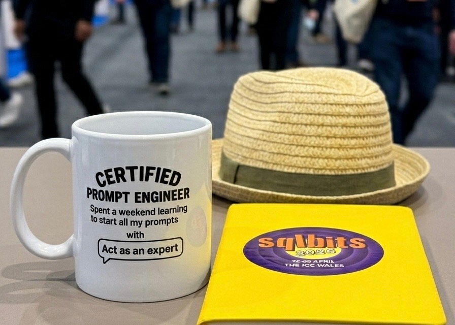
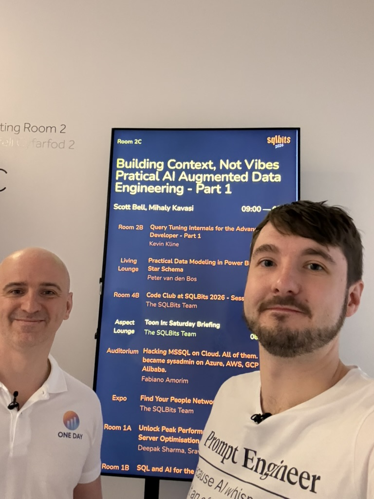
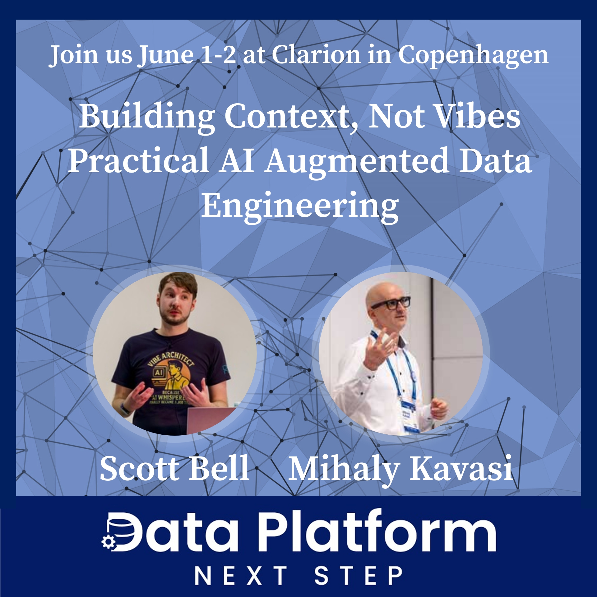

## Anyone can vibe-code a working AI demo

Yet Engineering one that is repeatable, observable and aligned with your organisation's quirks is a different sport entirely. That gap was the whole point of our talk this year.

This was my fifth SQLBits and my fourth time on stage. I co-presented *Building Context, Not Vibes — Practical AI Augmented Data Engineering* with [Mihaly Kavasi](https://www.linkedin.com/pulse/we-built-dbt-pipeline-live-stage-agents-asvme/) of [OneDayBI](https://www.onedaybi.com/about), and I think it's a great counterpoint to the fun yet depressing AI security talk I did last year.



The core message: stop reaching for cleverer prompts and start engineering the harness around them. Constrain the AI. Engineer the context. Make the system selective and specialised so it actually meets your standards. This emerging discipline is called [**agentic harness engineering**](https://www.anthropic.com/engineering/harness-design-long-running-apps) enabling repeatable blueprints and patterns that meet your organisation's quirks in long running sessions, not a generic coding chatbot bolted onto a database.

## What's a Harness?

The model itself isn't the system. The harness is everything around it from context, tool execution, guardrails, hooks, persistence to observability and it's where most of the actual engineering happens.

```{=html}
<style>
.dtk-harness{--green:#0aaa50;--green-bg:rgba(10,170,80,0.12);--green-glow:rgba(10,170,80,0.06);--card:#f5f7f6;--txt:#111827;--txt3:#6b7280;--bdr:rgba(17,24,39,0.08);--bdr2:rgba(17,24,39,0.15);font-family:'Inter',-apple-system,BlinkMacSystemFont,sans-serif;padding:32px;border:1px solid var(--bdr);border-radius:12px;margin:24px 0;background:#fff}
.dtk-harness h4{font-size:17px;font-weight:700;color:var(--txt);margin:0 0 6px}
.dtk-harness .h-sub{font-size:12px;color:var(--txt3);margin:0 0 24px}
.dtk-harness .h-nest{display:flex;flex-direction:column;align-items:center;gap:0}
.dtk-harness .h-layer{border:1.5px solid var(--bdr2);border-radius:14px;padding:18px 24px;width:100%;text-align:center;transition:border-color 0.2s}
.dtk-harness .h-outer{border-color:var(--green);background:var(--green-glow)}
.dtk-harness .h-children{display:flex;gap:12px;margin-top:14px}
.dtk-harness .h-child{flex:1;border:1.5px solid var(--bdr2);border-radius:10px;padding:16px;background:var(--card);transition:border-color 0.2s}
.dtk-harness .h-child:hover{border-color:var(--green)}
.dtk-harness .h-inner{border:1.5px solid var(--green);border-radius:10px;padding:16px;margin-top:14px;background:var(--green-bg)}
.dtk-harness .h-tag{font-size:10px;font-weight:600;color:var(--green);text-transform:uppercase;letter-spacing:0.08em;margin-bottom:4px}
.dtk-harness .h-title{font-size:15px;font-weight:700;color:var(--txt)}
.dtk-harness .h-desc{font-size:10px;color:var(--txt3);margin-top:3px}
</style>

<div class="dtk-harness">
<h4>The Agent Harness</h4>
<p class="h-sub">The LLM is one piece — the harness is everything around it that makes the system usable.</p>
<div class="h-nest">
<div class="h-layer h-outer">
<div class="h-tag">The Agent Harness</div>
<div class="h-title">Orchestration &amp; Safety Layer</div>
<div class="h-desc">Everything that wraps around the LLM to make it usable</div>
<div class="h-children">
<div class="h-child">
<div class="h-tag">Context</div>
<div class="h-title">Message History</div>
<div class="h-desc">Manages conversation, compaction, token budgets</div>
</div>
<div class="h-child">
<div class="h-tag">Execution</div>
<div class="h-title">Tool Runtime</div>
<div class="h-desc">Dispatches tool calls, handles errors, retries</div>
</div>
<div class="h-child">
<div class="h-tag">Safety</div>
<div class="h-title">Guardrails</div>
<div class="h-desc">Approval gates, iteration caps, doom loop detection</div>
</div>
</div>
<div class="h-children">
<div class="h-child">
<div class="h-tag">Interception</div>
<div class="h-title">Hooks Layer</div>
<div class="h-desc">Pre/post call interception</div>
</div>
<div class="h-child">
<div class="h-tag">Persistence</div>
<div class="h-title">State &amp; Memory</div>
<div class="h-desc">Session persistence, user preferences</div>
</div>
<div class="h-child">
<div class="h-tag">Telemetry</div>
<div class="h-title">Observability</div>
<div class="h-desc">Logging, tracing, cost tracking</div>
</div>
</div>
<div class="h-inner">
<div class="h-tag">The Core</div>
<div class="h-title">LLM (Claude / GPT / etc.)</div>
<div class="h-desc">The model itself — just one piece of the puzzle</div>
</div>
</div>
</div>
</div>
```

There are several practical benefits to viewing systems like this. Lower token spend. Fewer hallucinations because the model has fewer ways to misbehave. Outputs you can trust enough to put behind a CI pipeline.

The focus is on engineering systems that you continually improve, that a systems engineering mindset to what your building to empower you, not just the final output from the AI assisted process.

We also did some live demos that probably should have terrified us. We added a slide live, mid-talk, knowing it might break the deck. That was the point... engineering means knowing exactly what your system tolerates, and being able to prove it on stage. The questions and feedback afterwards were exactly the kind of thing I do talks for.


I rolled in late on Friday after a car rental saga that deserves its own post, so I spent less time with the community than I'd have liked. To everyone I caught up with such as folks I work with, have worked with, or am a general nuisance to online, it was good seeing you. To everyone I missed, sorry, and let's fix that next time.

 and full of familiar faces.](images/Seeing%20some%20familar%20faces%20in%20ai%20session%20.jpeg)

## See the deck

::: panel-tabset
### Part 1

<iframe src="https://fusionet24.github.io/Talks/2026/part1.html#/title-slide" width="100%" height="500" allowfullscreen>

</iframe>

### Part 2

<iframe src="https://fusionet24.github.io/Talks/2026/part2.html#/title-slide" width="100%" height="500" allowfullscreen>

</iframe>
:::

## If this resonated

This thinking shows up across a few other posts on the blog: [Agentic Security Risks](../agentic-security-risks/index.qmd) for the constraining-AI angle, [Agentic Decomposition](../agentic-decomposition/index.qmd) for controlling outputs, and [the AIOps Journey series](../aiops-journey-what-is-it/index.qmd) for the maturity model behind the message.

::: {.callout-tip title="Full-day training: Data Platform Next Step, Copenhagen"}
{width="420"}

Mihaly and I are running a **full-day training** at Data Platform Next Step in Copenhagen, **June 1–2 at the Clarion**. We'll go deeper than the SQLBits talk — building agentic systems iteratively, embracing continuous improvement, and engineering AI that meets your organisation's standards rather than fighting them.

[**Grab a ticket →**](https://dataplatformnextstep.com/tickets/)

You'll walk away with thoughts. I promise.
:::